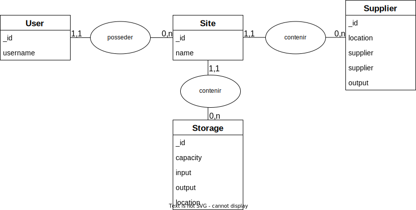
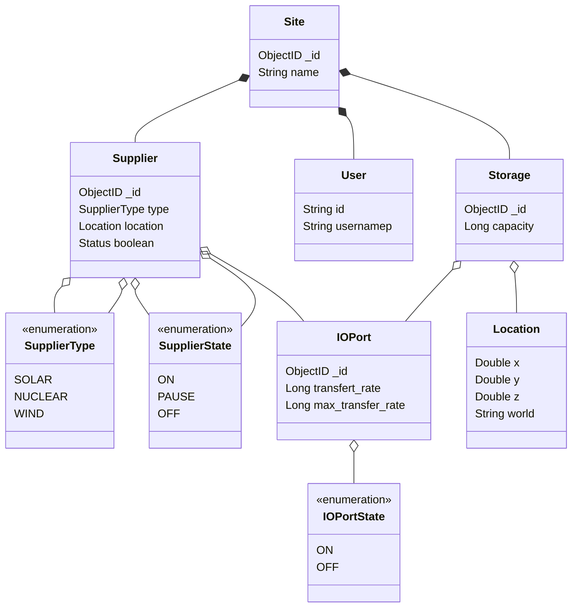

# cc-tweaked
*Authors: BERTRAND Thimothé, BLANC Olivier et LAVEYSSIERE Cyril*  

Nous avons fait un swagger pour documenter notre API, il permet de décrire les différentes routes disponibles, et de décrire les différents paramètres qui peuvent être passés à ces routes.

Vous pouvez consulter ce swagger en lancant le projet et aller sur `localhost:8080/swagger-ui/`

De plus, une Javadoc a été généré et vous pouvez la consulter depuis le répertoire Docs, présent à la racine du projet.

# API Controllers

Les controllers peuvent toute faire les méthode du CRUD, c'est a dire, pour chaque modules , l'api permet d'**obtenir une liste d'entitée**, **obtenir une seule entitée**, **ajouter**, **modifier** ou **supprimer**

## User Controller

|      |      |      |
| ---- | ---- | ---- |
|      |      |      |
|      |      |      |
|      |      |      |

## Site Controller

|      |      |      |
| ---- | ---- | ---- |
|      |      |      |
|      |      |      |
|      |      |      |

## Supplier Controller

|      |      |      |
| ---- | ---- | ---- |
|      |      |      |
|      |      |      |
|      |      |      |

## Storage Controller

|      |      |      |
| ---- | ---- | ---- |
|      |      |      |
|      |      |      |
|      |      |      |

## Diagramme MCD

## Diagramme de classes

