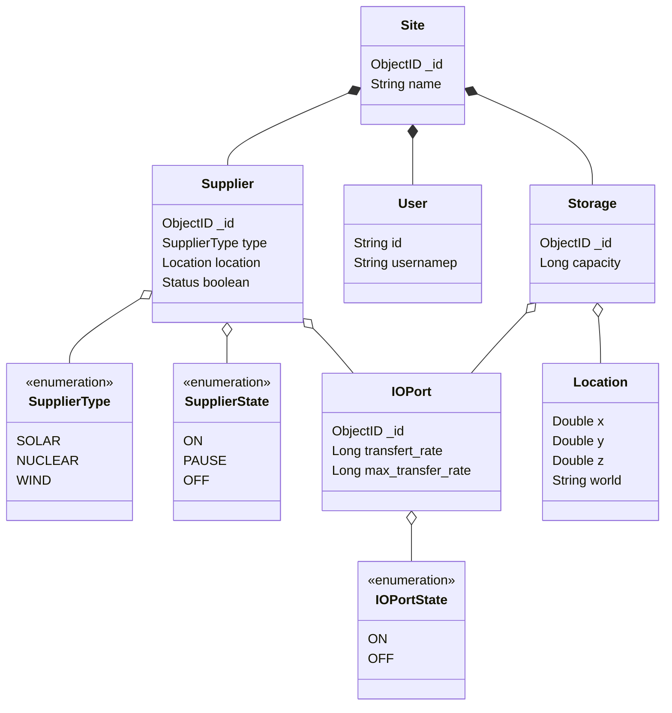

# cc-tweaked
*Authors: BERTRAND Thimothé, BLANC Olivier et LAVEYSSIERE Cyril*  

Nous avons fait un swagger pour documenter notre API, il permet de décrire les différentes routes disponibles, et de décrire les différents paramètres qui peuvent être passés à ces routes.

Vous pouvez consulter ce swagger en lancant le projet et aller sur `localhost:8080/swagger-ui/`

De plus, une Javadoc a été généré et vous pouvez la consulter depuis le répertoire Docs, présent à la racine du projet.

## API Controllers

Les controllers peuvent toute faire les méthode du CRUD, c'est a dire, pour chaque modules , l'api permet d'**obtenir une liste d'entitée**, **obtenir une seule entitée**, **ajouter**, **modifier** ou **supprimer**

Pour plus de détail, voici le lien vers notre swagger:

### Partie User

| Verbes | Route                     | Action                                                                              |
|--------|---------------------------|-------------------------------------------------------------------------------------|
| GET    | `/users`                    | Liste des utilisateurs                                                              |
| GET    | `/users/{id}               `| Obtenir un utilisateur                                                              |
| POST   | `/users                    `| Ajouter un utilisateur                                                              |
| PUT    | `/users/{id}               `| Modifier un utilisateur                                                             |
| DELETE | `/users/{id}               `| Supprimer un utilisateur                                                            |
| GET    | `/user/{id}/sites          `| Liste des sites d'un utilsiateur avec les suppliers et storage                      |
| GET    | `/user/{id}/sites/expanded `| Liste des sites d'un utilsiateur avec les suppliers et storage avec plus de détails |

### Partie Supplier

| Verbes | Route | Action |
|--------|-------|--------|
| GET    | `/suppliers`      |Liste des fournisseurs|
| GET    |   `/suppliers/{id}`    |Obtenir un fournisseur|
| POST   |  `/suppliers`     |Ajouter un fournisseur|
| PUT    |  `/suppliers/{id}`     |Modifier un fournisseur|
| DELETE |  `/suppliers/{id}`     |Supprimer un fournisseur|

### Partie Storage

| Verbes | Route | Action |
|--------|-------|--------|
| GET    | `/storages`      |Liste des stockages|
| GET    |   `/storages/{id}`    |Obtenir un stockage|
| POST   |  `/storages`     |Ajouter un stockage|
| PUT    |  `/storages/{id}`     |Modifier un stockage|
| DELETE |  `/storages/{id}`     |Supprimer un stockage|

### Partie Site

| Verbes | Route | Action |
|--------|-------|--------|
| GET    | `/sites`      |Liste des sites|
| GET    |   `/sites/{id}`    |Obtenir un site|
| POST   |  `/sites`     |Ajouter un site|
| PUT    |  `/sites/{id}`     |Modifier un site|
| DELETE |  `/sites/{id}`     |Supprimer un site|

## Diagramme MCD

## Diagramme de classes

